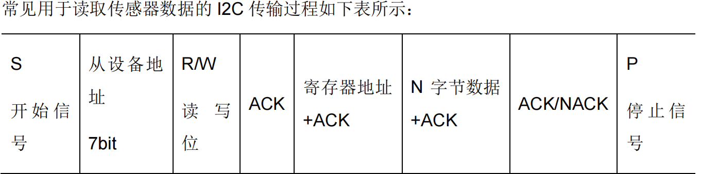
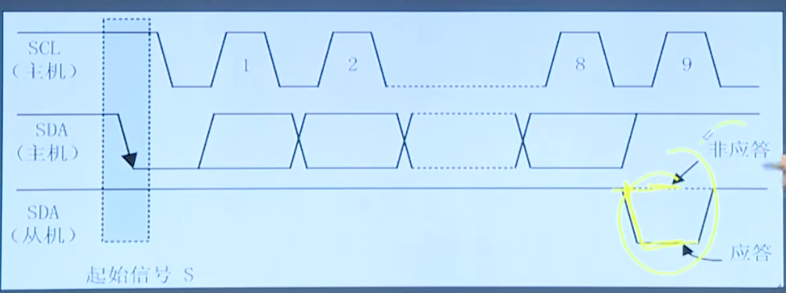

#                                   IIC总线

IIC：串行、半双工，近距离、低速芯片间通信（抗干扰能力差）。

- ### 双线：

SDA：数据线用于数据收发

SCL:时钟线，同步双方时钟

硬件结构简单，成本低廉。

- ### 多主机总线协议:

每个器件都可以作为主机或从机，每个IIC总线上的器件都有唯一一个地址（7bit）

具备冲突检测和仲裁的功能，防止错误产生。总线上的器件增加和删除不影响其它器件的正常工作。

- ### 通信过程

  1.主机发送起始信号启用总线

  2.主机发送一个字节数据指明从机地址和后续字节传送的方向。

  3.被寻址的从机发送应答信号回应主机

  4.发送器发送一个字节的数据

  5.接收器发送应答信号回应发送器

  ......(循环步骤4、5)

  6.通信完成后主机发送停止信号释放总线。

第一个字节：地址7bit+1bit发送方向（0主机向从机发，1从机向主机发）

- ### 起始信号和终止信号

空闲时SCL高电平，SDA拉低表示起始信号。空闲时SCL低电平，SDA拉高表示起始信号。

起始和停止信号都是由主机发出。

数据传送时，时钟线SCL为低电平发送器向数据线上发送一位数据，在此期间数据线上的信号允许发生变化。时钟线SCL为高电平时，接收器从数据线上读取一位数据，在此时数据线上的信号不允许发生变化（因为此时在接收数据，如果此时SDA线上面的信号发生变化，会影响数据接收）。

- ### 字节传送和应答

IIC传输时每次发送一个字节（必须以一个字节为单位），先传送高位，后传送低位。发送完一个字节的数据后接收器必须发送1位应答位来回应发送器，即一帧有九位。应答信号 ACK/NACK：应答信号是主机发送 8bit 数据，**从机对主机发送低电平**，表示已经接受数据。8bit数据位 （发送给接收）+ 1bit应答位。

- ### 基于大疆C型开发板上的IST8310磁力计

  开发板 C 型的 IST8310，I2C 的地址是 0x0E，读取 0x00 寄存器的值

`     0U,1U,2U`代表无符号的整型数。

