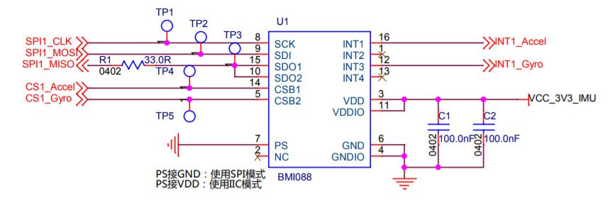

#                              SPI通信协议 

- ## 基于BMI088传感器的通信。

​        BMI088 传感器是一个**六轴惯性测量单元 (IMU)**，能够应用于机器人上的姿态解算，将在本章节学习六轴惯性测量单元的内部结构——三轴陀螺仪和三轴加速度计。该款 6 轴传感器在 3 x 4.5 x 0.95mm³小尺寸 LGA 封装中集成了 16 位 ADC 精度的三轴陀螺仪和三轴加速度计。陀螺仪是测量角速度的传感器，是 IMU 的重要组成部分。陀螺仪能测量在**三个正交方向上**旋转的角速度，也可以用于估算在三个方向上的旋转角度。

###     BMI088 芯片内部框架图





- ### 对BMI088通信时第一个字节的数据格式特点

注意：仅仅对于BMI088传感器这一个有效。

   SPI在进行1bit收发判断位+7bit地址位。**地址帧的第一位为1，代表读取数据的操作。地址帧的第一位为0，代表写入数据的操作。**例如`BMI088_read_write_byte((reg) | 0x80);` 0x80作为十六进制数，转换成二进制数后，就是10000000。所以当我们进行`(reg) | 0x80`这一步操作时，就是将该帧的首位数据置为1。因此将进行的就是读取操作。

```c#
#define BMI088_accel_read_single_reg(reg, data) \
    {                                           \
        BMI088_ACCEL_NS_L();                    \  
        BMI088_read_write_byte((reg) | 0x80);   \
        BMI088_read_write_byte(0x55);           \
        (data) = BMI088_read_write_byte(0x55);  \
        BMI088_ACCEL_NS_H();                    \
    }
```

### SPI通信数据格式：

​	18bit  1bit起始位+2bit操作码+7bit地址码+8bit数据码

​    同步——有SCK时钟线同步。

​     MSB最高位    LSB最低位  

​		SPI通信在进行数据传送是，先传送高位（bit），再传送低位（bit）。高电平为1，低电平为0。一个字节传输完后无需（也不会）从机应答即可开始下一个字节的传送（无法 确定接收器是否接收到了数据，有可能发送方一个人在唱戏）。 时钟线在上升沿或下降沿时发送器向数据线上发送数据，**在紧接着的下降或上升沿**（可能有歧义：如果是上升沿发，就是紧接着的下降沿收。如果是下降沿发，就是紧接着的上升沿收。）时接收器从数据线上读取数据，完成一位数据传送。


### SPI的极性（CPOL）和相位（CPHL）的概念

#### CPOL表示SCLK空闲时的状态

 	CPOL=0,空闲时SCLK为低电平。	CPOL=1，空闲时SCLK为高电平。

#### CPHA表示采样时刻

 CPHA=0,每个周期的第一个时钟沿采样。	CPHA=1，每个周期的第二个时钟沿采样。  （上升沿发，下降沿接或者上升沿接，下降沿发）

**所以一共有2*2四种工作模式。**


### IIC和SPI的异同

#####     相同点：

1. 采用串行、同步的方式。

2. 均采用TTL电平，传输距离和应用场景类似（板子内部的设备间通信）。

3. 均采用主从工作方式。

   ##### 不同点：

   1.IIC为半双工，SPI为全双工

   2.IIC有应答机制，SPI为无应答机制

   3.IIC通过向总线广播从机地址来寻址，SPI通过向对应从机发送片选信号

   4.IIC的时钟极性和时钟相位固定，SPI的时钟极性和时钟相位可调。

   5.IIC节省引脚节约线，但是费时间。SPI通信更快但是费引脚费线。

