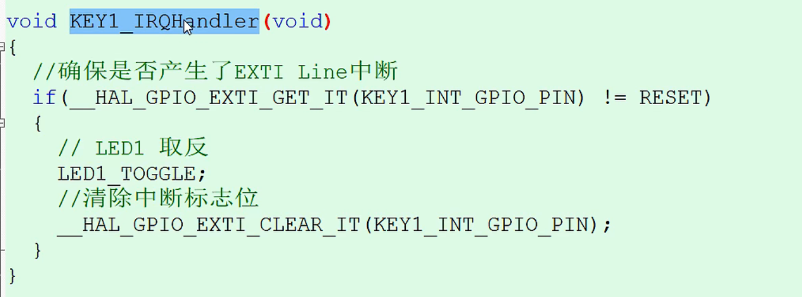

#  野火学习笔记

- #### STM32EXTI

通过EXTI线，捕获EXTI线事件，并且生成中断，在中断中，反转LED灯的状态，并且清楚EXTI中断标志（中断标志要清除，不然就会一直产生中断）。如果不清楚中断标志，系统的中断会一直处于挂起状态，系统会一直进入中断。  

- #### SysTick定时器

SysTick系统定时器含有一个计数宽度为24bit（2的24次方）的向下递减的自动重装载计数器，计数器每计数的时间为1/CLKSource。一般我们设置CLKSource为系统时钟。（例如f103的计数工作周期：1/CLKSource，1/72Mhz） 

