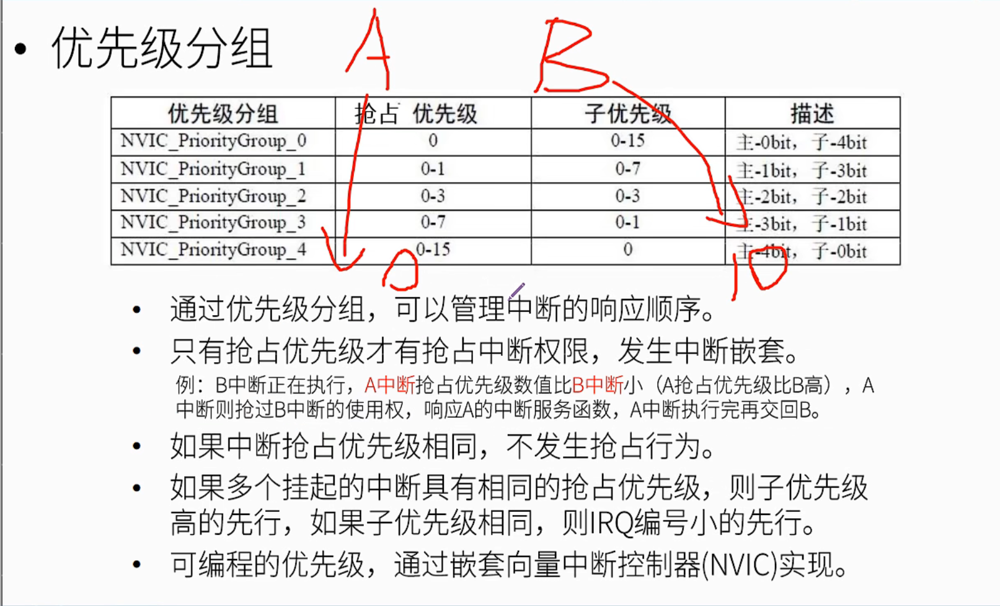

# STM32寄存器

- ### 寄存器地址偏移

32位数据_寄存器地址每次偏移四个字节例如（0x00,0x04,0x08,0x0C）

16位数据_将一个32位寄存器拆成两个16位寄存器，地址偏移两个字节**（本质上还是访问一个32位寄存器）**例如（0x18,0x1A，0x1C）

- ### 数据位操作

根据数据手册上的寄存器种类（进行哪种设置或进行哪种操作的寄存器），在对应寄存器的对应数据位（bit)进行置0或置1的操作以完成需要达到的效果，例如（使能GPIO、GPIO的模式、GPIO的高低输出电平等等）

- ### HAL库引脚初始化的本质

利用宏定义将寄存器地址和操作位可视化，码农可以直接对可视化数据（例如将地址和对应偏移量改为GPIOC、GPIO_PIN_13）进行操作。提前封好一套逻辑严密的函数，根据码农所输入的可视化数据的来帮你写好寄存器的位。

- NVIC主优先级和次优先级

