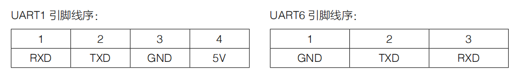

#                    UART通用异步收发器

​      UART通用异步收发器：串行、异步，实现全双工的发送和接收常用于主机与辅助设备之间的通信。

### 一些通信的基本概念：

- #### 单工通信

- #### 双工通信:

​    1.全双工通信（两线，收发可同时进行）

​    2,半双工通信（一线，收发不可同时进行）

- #### 波特率：

用于描述串口通信时的通信速率，单位bps（bit per second）即**每秒钟传送的bit的数量**。

### UART的帧格式：

起始位1bit+数据位8bit/9bit+校验位1bit（可有可无，奇偶校验位）+停止位1bit/1.5bit/2bit 

空闲位必须为高电平，通过起始位拉低电平代表数据发送开始。 

数据位是先发低位，再发高位（注意区别SPI通信时先发高位，后发低位；I2C也是先发高位，后发低位）

异步：掐时间，时钟采样。不允许连续发送数据，避免累计误差的出现，隔一段时间重新掐时间。

- ### RM开发板C型串口配置注意事项

1.UART接口的RX与接收器的TX对应，UART接口的TX与接收器的RX对应。

2.开发板外壳丝印有误。外壳丝印UART1对应STM32的UART6，外壳丝印UART2对应STM32的UART1。

 HAL_UART_Receive_IT(&huart1,(uint8_t *)aRxBuffer, 1); 即Size设置为1，只接收1Byte(字节)数据，在每次中断结束后重新配置来使能中断。

