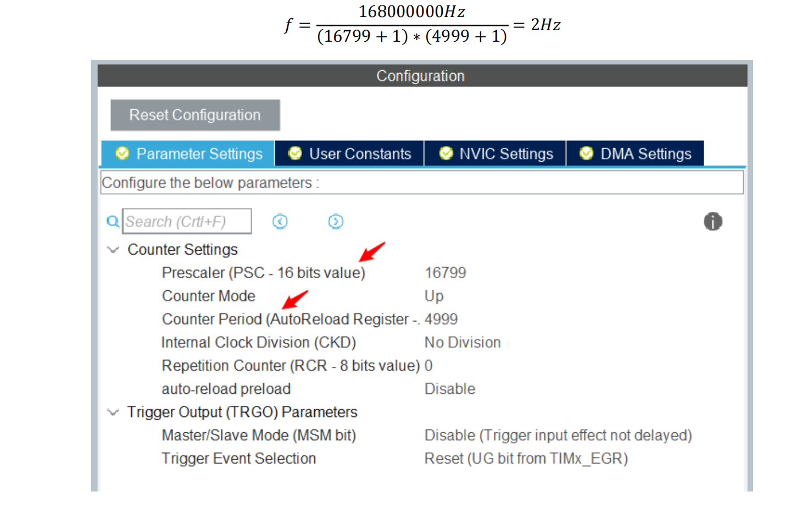

#                                定时器

- ### PWM（脉冲宽度调制）

  ​        脉冲宽度调制是一种模拟控制方式，根据相应[载荷](https://baike.baidu.com/item/载荷/811795?fromModule=lemma_inlink)的变化来调制[晶体管](https://baike.baidu.com/item/晶体管/569042?fromModule=lemma_inlink)基极或MOS管栅极的偏置，来实现晶体管或[MOS管](https://baike.baidu.com/item/MOS管/8703611?fromModule=lemma_inlink)导通时间的改变，从而实现开关稳压电源输出的改变。这种方式能使电源的输出电压在工作条件变化时保持恒定，是利用微处理器的数字信号对[模拟电路](https://baike.baidu.com/item/模拟电路?fromModule=lemma_inlink)进行控制的一种非常有效的技术。广泛应用在从测量、通信到功率控制与变换的许多领域中。

- ## 四个重要寄存器。

##### 1.预分频寄存器（Prescaler register） TIMx_PSC

##### 2.计数器寄存器（Counter register） TIMx_CNT

##### 3.自动重装载寄存器（Automatic overload register） TIMx_ARR

##### 4.比较寄存器（compare register）TIMx_CCRx

​		时钟源处的时钟信号经过预分频寄存器，按照预分频寄存器内部的值进行分频。比如时钟源的频率为 16MHz，而预分频寄存器中设置的值为 16：1，那么通过预分频后进入定时器的时钟频率就下降到了 1MHz。在已经分频后的定时器时钟驱使下，TIMx_CNT 根据该时钟的频率向上计数，直到TIMx_CNT 的值增长到与设定的自动重装载寄存器 TIMx_ARR 相等时，TIMx_CNT 被清空，并重新从 0 开始向上计数，TIMx_CNT 增长到 TIMx_ARR 中的值后被清空时产生一个定时中断触发信号。综上定时器触发中断的时间是由设定的 TIMx_PSC 中的分频比和TIMx_ARR 中的自动重装载值共同决定的。

注意，此处的168000000Hz指的是对应芯片定时器的APBx（x==1,2,3）总线上的timer clocks（时钟源频率）的频率。16799是预分频寄存器的值，4999是重载寄存器的值，注意处是从0开始计数。

当定时器以 PWM 模式工作时，会自动将 TIMx_CCRx 的值与 TIMx_CNT（计数寄存器）中的值做比较，当 TIMx_CNT 中的值小于 TIMx_CCRx 的值时，PWM 输出引脚输出高电平，大于时则输出低电平。因此知道了 PWM 信号的周期和占空比可以通过设置比较寄存器TIMx_CCRx 和定时器重载寄存器 TIMx_ARR 来控制。一个定时器工作在 PWM 输出模式下时，有 4 个通道可以进行 PWM 信号的输出，每一个定时器都有对应标号的比较寄存器，比如 5 号定时器的 1 号通道对应的比较寄存器为TIM5_CCR1。PWM 的占空比可以通过下图公式计算：

以下图为例，该定时器的重载值为 8，比较寄存器值为 4，输出信号为 OCXREF,则其占空比为 44.4％。定时器重载寄存器 TIMx_ARR的重载值决定一个PWM的输出周期，而比较寄存器TIMx_CCRx的值决定了该周期PWM的占空比。 

